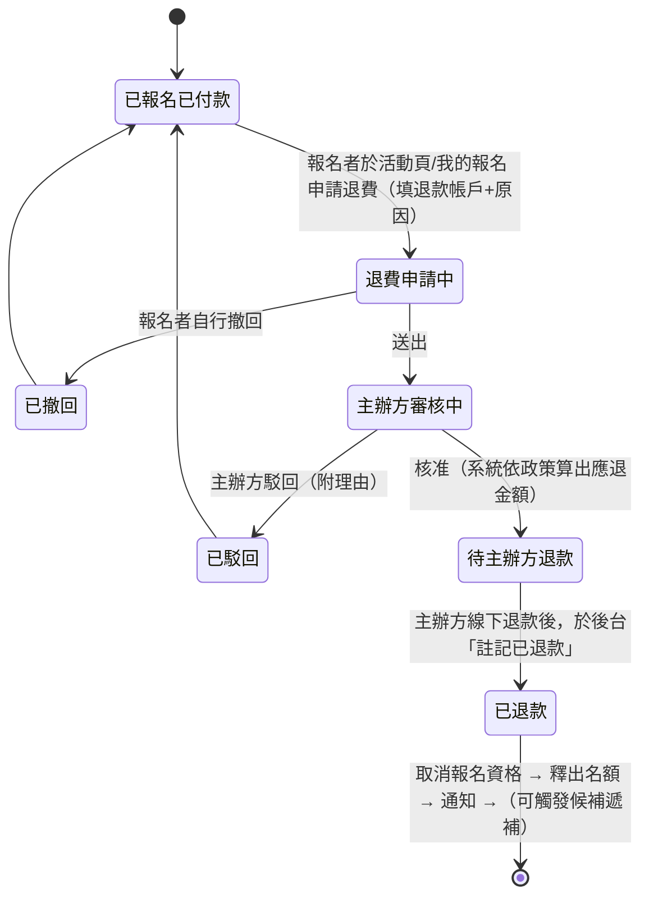
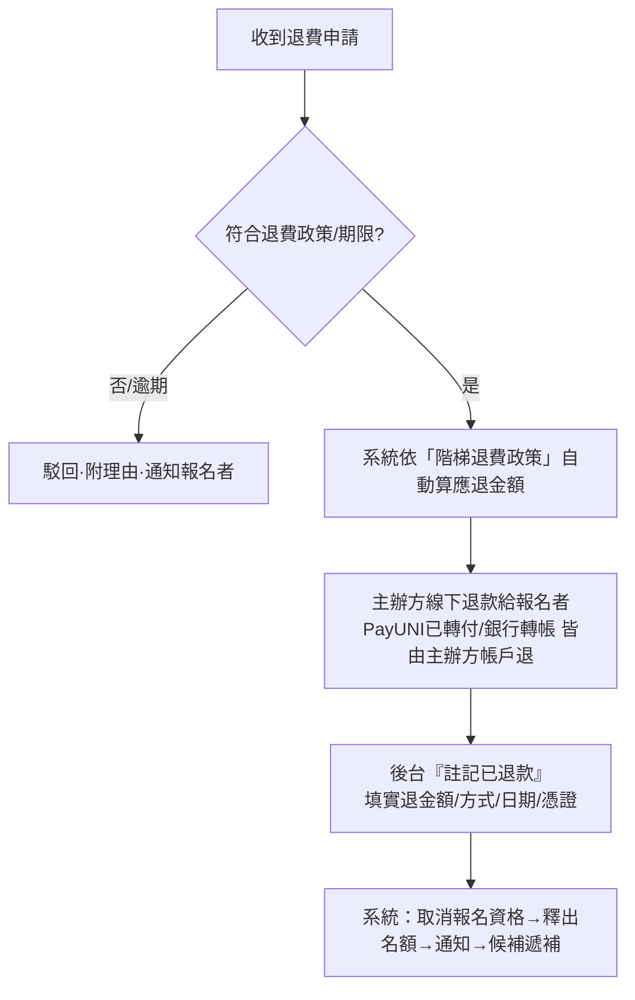
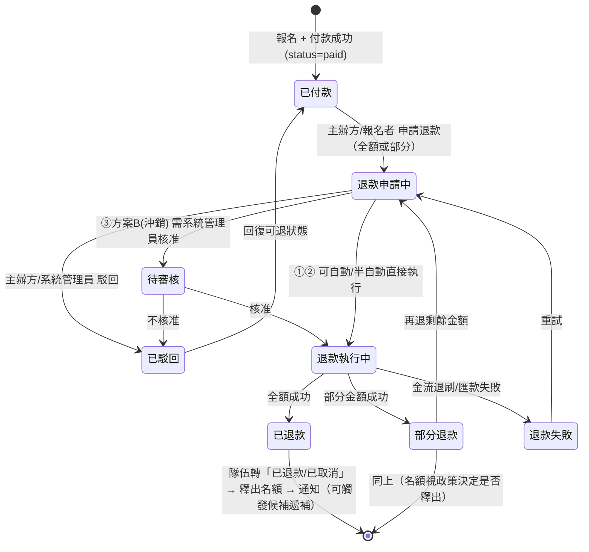
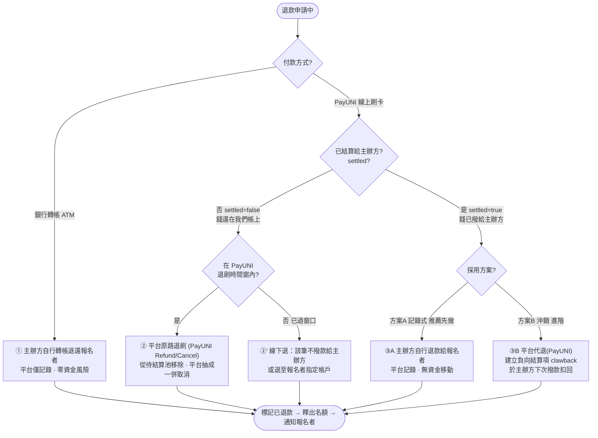
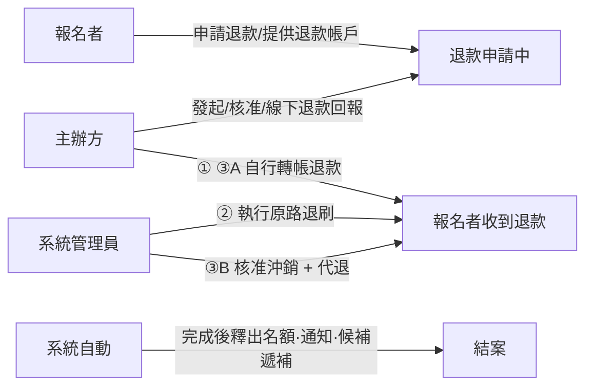

# RegMaster 退款機制 — 規劃稿

> **採用方向（v2 思維）：主辦方全責、平台不碰 PayUNI 刷退。**
> 平台只負責「收款 → 定期轉付主辦方」。報名者要退費 → 主辦方自行退款 → 在平台註記退款 →
> 系統取消報名資格、釋出名額。另提供：報名者端「線上申請退費/退賽」、主辦方端「階梯退費政策設定（含法定下限保護）」。
> （文末保留 v1「平台沖銷/原路退刷」版本作為日後進階選項。）

---

## A. 角色與資金原則（v2）
- 平台**永遠不執行 PayUNI 刷退**，不從平台帳戶退錢。
- 不論 PayUNI 或銀行轉帳，**退款一律由主辦方自行付款**給報名者（錢最終都在主辦方手上：銀行轉帳本就直入主辦方；PayUNI 也會定期轉付主辦方）。
- 平台角色＝**流程與紀錄**：收退費申請、依政策算應退金額、待主辦方退款後註記、取消資格、釋出名額、通知、稽核。

## B. 報名者端「線上申請退費/退賽」流程



## C. 主辦方後台處理流程



## D. 階梯退費政策設定（主辦方）＋ 法定下限保護

主辦方設定「距活動開始 N 天 → 退費 X%」級距表。平台依所選**法規範本**對每一級距套用
**法定最低退費%（下限）**：主辦方可設「更寬鬆（退更多）」，但**不得設低於法定下限**（UI 擋下並提示）。

### 範本一：旅遊/營隊型（天數級距）— 依「國內旅遊定型化契約」
（退費下限 = 100% − 法定賠償上限）

| 距活動開始 | 法定最低退費%（下限） |
|---|---|
| 41 天以前 | 95% |
| 31–40 天 | 90% |
| 21–30 天 | 80% |
| 2–20 天 | 70% |
| 前 1 天 | 50% |
| 活動當天/之後/未通知 | 0% |

### 範本二：課程/補習型（進度式）— 依「短期補習班設立及管理準則 §24」
| 時點 | 法定最低退費% |
|---|---|
| 開課（活動）前 | 90%（扣款逾 NT$1,000 部分仍須退；代辦費全退；報名費不得扣抵） |
| 開課後、未達總時數 1/3 | 50% |
| 達 1/3 以上 | 0%（得全數不退） |

### 範本三：一般活動/競賽（無專屬主管法規）
平台不強制法定值，提供「旅遊級距」為**建議保守下限**，並顯示提醒：請主辦方自行確認所屬主管機關規範。

> 法規來源：短期補習班設立及管理準則 §24（全國法規資料庫 H0080087）、國內旅遊定型化契約應記載事項（交通部/行政院）。

## E. 計算基準（待主辦方確認的政策點）
- 基準金額＝**報名者實付金額**。
- 是否允許「不可退費用」先扣（如金流手續費、行政規費）後再套用比例？
  - 旅遊範本：法定基準「先扣行政規費」後計算。
  - 補習班範本：**報名費不得自應退費用中扣除**、代辦費全退。
- → 依所選範本套不同規則；UI 顯示試算明細給報名者看。

## F. 資料模型（v2）
```
config/sales 或 competitions/{id}.config.refundPolicy
  template   : travel | course | general
  tiers      : [{ daysBefore: 41, refundPct: 95 }, { daysBefore: 31, refundPct: 90 }, ...]
  deductibles: { paymentFee: bool, adminFee: number }   # 不可退費用（依範本限制）
  note       : string

refundRequests/{reqId}
  reqId, compId, creator, teamId, requesterName, requesterEmail
  refundAccount(報名者退款帳戶), reason
  status      : requested | reviewing | approved | rejected | refunded | withdrawn
  policyPct   : number      # 套政策算出的應退比例
  paidAmount  : number      # 報名者實付
  calcRefund  : number      # 系統算出應退金額
  actualRefund: number      # 主辦方實退（註記時填）
  refundMethod, refundProof, refundedAt, operator, createdAt, decidedAt
```

## G. 名額釋出時點（待確認）
- 方案 a：核准退費當下即釋出名額（讓候補快點遞補）。
- 方案 b：主辦方「註記已退款」後才釋出（較保守，確保真的退了才放出）。

---


> 核心原則：**誰手上有錢，誰退款**。平台只在「錢還在我們 PayUNI 帳戶」時才動用原路退刷；
> 錢已撥給主辦方者，由主辦方退款（記錄式）或從主辦方未來結算款沖銷。

---

## 一、單筆訂單退款生命週期（狀態機）

`regPayments.refundStatus` 欄位的狀態流轉（同時連動 team.status）。



---

## 二、退款路由決策（付款方式 × 結算狀態）

進入「退款執行中」前，系統依此分流到正確的退款動作。



---

## 三、各分支的資金移動對照

| 分支 | 觸發條件 | 誰退錢給報名者 | 平台資金影響 | 主辦方資金影響 | 自動化程度 |
|---|---|---|---|---|---|
| ① 銀行轉帳 | channel=bank | 主辦方（線下轉帳） | 無 | 自行吐回（本來就在他帳上） | 記錄式（半自動） |
| ② PayUNI 未結算 | payuni + settled=false + 在退刷窗 | 平台（原路退刷） | 退出＝退報名者，但此筆本就還沒撥給主辦方 → 打平 | 從未拿到此筆 | 可自動 |
| ②' PayUNI 未結算·過窗 | payuni + settled=false + 過退刷窗 | 平台（線下退）或不撥款 | 該筆不撥出 | 拿不到此筆 | 半自動 |
| ③A 已結算·記錄式 | payuni + settled=true | 主辦方（線下轉帳） | 無 | 自行吐回（錢已在他帳上） | 記錄式 |
| ③B 已結算·沖銷 | payuni + settled=true | 平台（原路退刷） | 先墊付，之後從主辦方結算扣回 | 下次撥款被扣回該淨額 | 需系統管理員核准 |

> 關鍵：**只有 ② 與 ③B 平台會動用 PayUNI 退刷**。③B 一定搭配 clawback 沖銷，確保平台不會「已撥款又自付退款」。

---

## 四、角色與權限（誰能做什麼）



- **報名者**：在「我的報名」申請退款、填退款帳戶（線下退時用）。
- **主辦方**：在「報名管理」發起/核准退款；①③A 由其自行轉帳並回報完成。
- **系統管理員**：在「帳務」執行 ② 原路退刷、核准 ③B 沖銷。
- **系統自動**：完成後改隊伍狀態、釋出名額、寄通知、觸發候補。

---

## 五、資料模型（沿用 regPayments + 新增 refunds）

```
regPayments/{orderId}  (新增欄位)
  refundStatus   : none | requested | review | refunding | refunded | partial | rejected | failed
  refundAmount   : number           # 累計已退金額
  refundMethod   : payuni | bank | clawback
  refundedAt     : "YYYY/.."        # 完成時間
  refundBy       : username         # 執行者
  refundNote     : string           # 原因/備註

refunds/{refundId}     (每筆退款事件，供稽核)
  refundId, orderId, compId, creator, teamId
  amount, method(payuni/bank/clawback), channel(payuni/bank)
  wasSettled : bool                 # 申請當下是否已結算（決定走哪格）
  clawback   : bool                 # 是否計入主辦方負向結算
  status, createdAt, operator, note

settlements/{id}       (方案B 需支援負項)
  + clawbackItems[]  或  net 允許為負（從待撥款扣除）
```

---

## 六、實作階段建議

- **第一階段（零資金風險，先上）**：① + ③A（記錄式）+ ② 的「標記/釋出名額/通知/候補」骨架，**先不接 PayUNI 退刷 API**（②②'③B 先走線下/記錄）。
- **第二階段**：確認 PayUNI 退刷 API 與時間窗後，接上 ② 真原路退刷。
- **第三階段**：③B 沖銷（settlements 負項 + 系統管理員核准 UI）。

## 七、待你拍板的政策點
1. ③ 先做方案 A（記錄）還是直接做方案 B（沖銷）。
2. 手續費歸屬：金流手續費是否扣報名者；平台抽成在已結算退款是否沖回。
3. PayUNI 退刷時間窗（需向 PayUNI 確認天數/規則）。
4. 是否支援部分退款。
5. 部分退款是否釋出名額。
